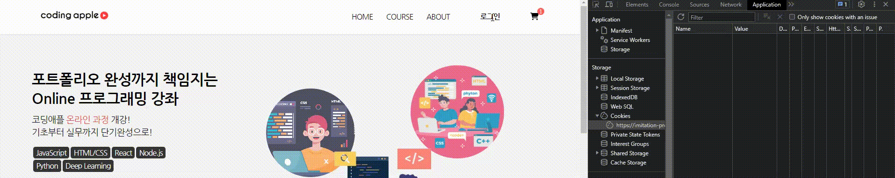
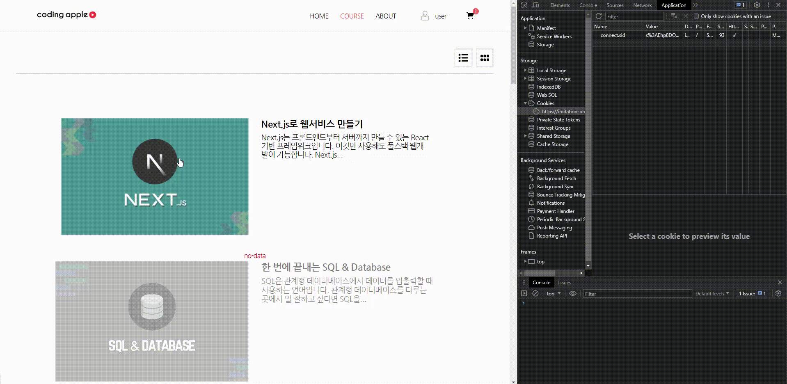
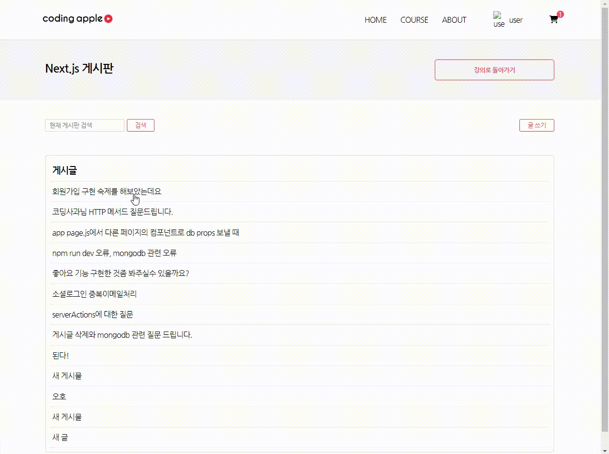
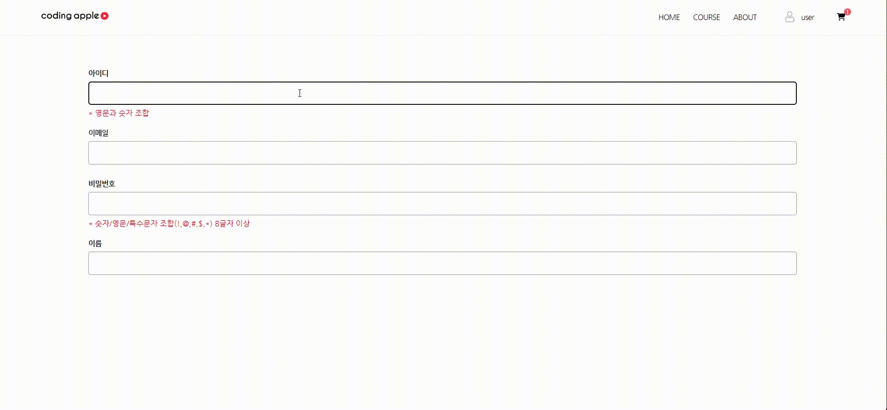
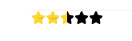

# 강의사이트 구현해보기

[코딩애플]: https://codingapple.com/

### 실제 수강 중인 [코딩애플] 사이트 구현!

코딩인생 첫 MERN 스택 포폴

<p align="center">
  
  
</p>
<p align="center">
  
  
</p>

## STACK 🧩

- Mongo DB
- Express
- React
- Node.js

## 구현 📱

- Session 방식 로그인
- 장바구니
- 게시판
- 댓글, 대댓글
- 강의 상세페이지

## 컴포넌트별 기능

- **Nav**

  - DB에서 사용자의 로그인 정보를 받아와 그에 따라 UI를 변경
  - DB의 장바구니의 데이터 length가 1 이상일 때부터 장바구니 아이콘에 알림 표시


    - **로그인 시연**
   
      
      

- **Detail**

  - 마운트 될 때마다 `url Parameter`를 통해 DB에서 해당하는 강좌의 데이터를 가져와 fetch
  - 해당 강좌의 커리큘럼 테이블, 리뷰, 강의 소개
  - 강의 소개의 데이터는 `react-html-parser`을 통해 string 형태의 html을 렌더 된 html로 변환
  - 신청하기 버튼 클릭 시 DB에 데이터를 보내 강좌 정보를 장바구니에 추가
  - 게시판으로 이동 시 강좌의 이름을 `url Parameter`로 전송

- **Board**
  - 마운트 시 해당 강좌 DB의 게시물들을 fetch
  - 게시물을 클릭 시 DB에 해당 게시물의 제목을 post 하고 상세페이지로 이동
  - UI 조작을 통해 게시글 작성 form 상태 변경

    - **게시판 기능 시연**
   
      
      
    
- **BoardContent**
  - Board페이지에서 게시물 클릭시 서버에 강좌명, 클릭한 게시물 이름등을 넘겨 해당 게시물의 상세데이터를 가져옴.
  - 댓글 발행
  - 대댓글 작성 시
    DB에서 1차적으로 발행 된 부모 댓글의 `Obect Id`를 찾아 update 하고 대댓글 발행

    - **대댓글 기능 시연**
   
      
      

- **Cart**
  - Detail page에서 신청하기 버튼 클릭 시, 서버로 해당 강좌 이름을 `url-parameter`로 날려 강좌 DB에서 찾고 장바구니에 추가.
  - 같은 아이템이 달릴 경우 수량만 증가.
  - UI에는 강좌 이름, 가격, 수량이 표기되어 테이블로 나타냄.
  - 테이블의 한 row 가장 왼쪽 X 버튼 클릭시 해당 테이블 아이템의 id를 서버로 보내 DB에서 찾은 후
    만약 해당 아이템의 수량이 1보다 크다면 수량만 -1 하고, 수량이 1보다 작을 경우 테이블에서 제거.

- **SignIn**
  - 사용자의 ID, PW, Email 정보를 받을 때 정규표현식을 이용하여
    조건(영문과 숫자만 | 특수문자와 영어 대소문자 등)을 충족하지 않으면 modal 창을 띄워 정보를 수정하도록 함. (현재 ID 검증, PW 검증 완료 )
  - 가입 시 서버로 정보를 전달하여 DB의 user collection에 회원정보를 등록한다.
 
    - **영문과 숫자만 가능한 input 값에 특수문자 또는 한글이 들어오면 경고창을 띄움**
   
      
      

    - **정규표현식으로 비밀번호 강도를 분류, 강도에 따라 UI 변경**
 
   
      
      


<br/>

## 현재 문제점 🔨🛠️

- ~~배포 후 새로고침 시 페이지가 Raw json으로 보여지는 것~~ (해결)
- Nav 컴포넌트의 장바구니 아이콘의 알림이 실시간으로 반영되지 않는 것

  <br/>

# 일별 활동기록 🗓️

# 1 ~ 4일 차

- Nav Comp 제작
- MainPage_section 제작
- MainPage_2번 section 제작, MainPage 반응형 적용
- MainPage 완료

# 5일 차

[백엔드 학습](https://github.com/Newbie-Alert/serverTutorial) 🔥

- 서버와 연동하여 로그인 기능 추가
- **passport** 라이브러리를 통하여 local 방식 인증을 사용
- useEffect를 통해 Nav 컴포지션이 마운트 될 시, DB의 유저 데이터 속 activate 값에 따라 UI 변경

# 6일 차

- Course Page 만드는 중
- DB에서 강의 목록 정보를 가져와 UI 생성
- mongo DB의 search index를 통해 UI목록을 최신순, 가나다순, 인기순으로 정렬하는 기능을 추가할 예정
  <br/>

# 7일 차

- course Page UI 수정

# 8일 차

- 서버에서 url parameter를 사용하여 각각의 detail페이지에 필요한 정보를 제공할 수 있도록 API를 제작.  
   이제 detail페이지를 열 때 해당 detail page에 필요한 데이터를 가져올 수 있다.

  ### 예시

  요청에 담겨오는 `url parameter`와 `같은 id 값을 가진 데이터`를 DB에서 찾아서 프론트로 전달해주는 것.  
   주의할 부분은 `url parameter`는 `String 타입`이라서 `형변환이 필요`하다는 것

  ```javascript
  < server.js >

  app.get("/detail/:id", function (req, res) {
    db.collection("data").findOne(
      { id: parseInt(req.params.id) },
      function (err, result) {
        res.json(result);
      }
    );
  });
  ```

### 문제

- 서버에서 데이터를 가져와 `state`에 적용하기까지는 성공했으나,  
  `state`가 자꾸 새로고침 할 때마다 초기화 되어 데이터가 없다고 한다.

# 9일 차

- Detail Page 제작 성공
- 아직도 왜 새로고침 할 때마다 useEffect가 작동하지 않았었는지 아직 이유는 잘 모르겠다.....🤔🤔🤔🤔🤔🤔

### ↪️ (12일 차에 찾은 해결방안)

- useEffect는 layout이 먼저 렌더 된 다음 실행되기 때문에
  페이지가 새로고침 될 때마다 state가 초기 값으로 갔던 것.
- 서버에서 가져온 데이터를 사용하는 layout은 **useEffect가 실행되어 state에 값이 있을 때 나타나도록** `삼항연산자` 사용

# 10일 차

### DB의 데이터를 어떻게 차곡차곡 유용하게 정리하나..

Detail Page에 정보가 많이 들어간다.  
처음에는 간단히 생각하고 주먹구구 식으로 DB를 만들었는데  
강좌 커리큘럼 테이블에 들어갈 데이터,  
리뷰단에 들어갈 리뷰 데이터,
리뷰는 리뷰를 강좌 카테고리별로 나눠야 하고,  
데이터를 어떻게 만들어놔야 할지 복잡하다

<br/>

### 문제와 해결

#### **Html parsing**

DB에서 커다란 `String`형태의 `html`자료를 리액트에 바인딩 해보니  
아래와 같이 String 형태로 나오는 문제가 있었다.

```
<p>&nbsp;</p>
<p>Next.js는 프론트엔드부터 서버까지 만들 수 있는 React기반 프레임워크입니다.</p>
<p>이것만 사용해도 풀스택 웹개발이 가능합니다.&nbsp;</p>
<p>&nbsp;</p>
<p>Next.js 사용시 서버사이드 렌더링이 쉽기 때문에&nbsp;</p>
```

구글링을 해보니 `String형태의 html`을 `html로 렌더`하여 출력해주는 라이브러에 대해 알게 됐다.
`react-html-parser` 라는 라이브러리였는데
사용법과 효과는 아래와 같았다.

### react-html-parser 사용법

```javascript
<detail.jsx 코드>

import {HtmlParser} from "react-html-parser";

// main
function Detail(){
  return(
    ~~~~~
  )
}

// component
function TAB({ data }) {

  const htmlString = data.about; // string 형태의 html을 변수에 담고

  return <div className={styles.tab}>{HtmlParser(htmlString)}</div>;
  // htmlParser() 안에 앞서 만든 변수를 인자로 보낸다
}
```

### react-html-parser 적용 후 결과

- 깔끔하게 html이 렌더되었다.

```txt
Next.js는 프론트엔드부터 서버까지 만들 수 있는 React기반 프레임워크입니다.

이것만 사용해도 풀스택 웹개발이 가능합니다.


Next.js 사용시 서버사이드 렌더링이 쉽기 때문에
```

# 11일 차

### 강의 DB 구축

- 강의의 테이블 UI를 반복문으로 축약하여 제작할 때 편리하도록 제작하였다.

```JSON
"chapter":[
  {"title":"Next.js 많이 쓰는 이유를 알아보자","duration":"06:00"},
  {"title":"Next.js 설치와 개발환경 셋팅","duration":"06:00"},
  .....
  ]
```

### 미래 계획

- DB에 리뷰처럼 보일 데이터를 만들기
- 실제 리뷰를 작성할 때 리뷰의 개수와 평점, 고유 ID를 부여할 collection 생성
- 리뷰 데이터를 가져와 detail page UI에 렌더

# 12일 차

### 추가된 부분

- 리뷰 섹션 추가
- DB에 리뷰, 리뷰 관리 데이터 구축
- detail page 반응형으로 수정

### DB 구축

- DB는 review, reviewCount 컬렉션을 생성하여  
  각각 리뷰와 리뷰 갯수, 점수등을 기록하도록 구축하였다.
- `url parameter`를 사용하여 해당 과목의 디테일 페이지에서 해당 과목의 데이터를 찾아서 가져오기 유용하도록 데이터에 고유 id를 부여

```javascript

<Detail.jsx 의 useEffect의 get요청>
// axios all을 사용하여 여러 개의 데이터를 가져오도록 하였다.

let id = useParams();

axios.all([
  axios.get(`http://localhost:8080/reviews/${id.id}`),
  axios.get(`http://localhost:8080/count/${id.id}`),
])
.then(
  axios.spread((res1, res2) => {
    setReviews(res1.data.review);
    setReviewCount(res2.data.count);
  })
);


<server.js>

app.get("/reviews/:id", function (req, res) {
  db.collection(`reviews`).findOne(
    { id: parseInt(req.params.id) },
    function (err, result) {
      res.json(result);
    }
  );
});

app.get("/count/:id", function (req, res) {
  db.collection(`reviewCount`).findOne(
    { id: parseInt(req.params.id) },
    function (err, result) {
      res.json(result);
    }
  );
});
```

- 이제 게시판, 강의 재생 페이지, 카트/구매 기능이 남았다.

# 12일 차

### 강좌 평균점수에 따라 별점이 표기되도록 하였다

- CSS 의 `mix-blend-mode`를 통해 배경의 `width`에 따라 별의 색상이 변경되게 한 후  
   배경의 `width 값`에 평균 값을 주게 되면 이렇게 된다!!

  ```CSS
  <CSS>

  .star_box {
  width: fit-content;
  height: 20px;
  background-image: url("https://dummyimage.com/1000/fcd62d.png");
  background-repeat: no-repeat;
  background-size: cover;
  background-position: left;
  }

  .star_box div {
  mix-blend-mode: screen;
  color: black;
  background-color: white;
  width: 100%;
  height: 100%;
  }
  ```

  ```javascript
  <Detail.jsx>

  function STAR({ ReapeatStar, average }) {
  return (
    <div
      className={styles.star_box}
      style={{ backgroundSize: `${average}% 20px` }}
    >
      <div>
        {ReapeatStar.map((i) => {
          return (
            <FontAwesomeIcon key={i} icon={faStar} className={styles.star} />
          );
        })}
      </div>
    </div>
  );
  }
  ```

평균이 50일 때의 별점이 표기되는 모습



### 문제였던 것

- 분명 배경은 너비가 50% 인데 자꾸 별점은 54% 정도로 나오는 것.

### 해결

- 별점의 색을 채우는 배경 `div` width를 `fit-content`로 하여  
  div 안의 요소인 `별 5개 만큼의 너비`를 주어 너비를 같게 하였다.

# 13일 차

- 게시판 글 게시 기능 추가
- 게시판 글 Page 완성

### 문제

- DB를 어떻게 체계적으로 잘 정리할지 API를 만드는데 머리가 조금 복잡했다.

### 해결

- API에 `url parameter`를 두 개 전달하여  
  /게시판/`'강좌 이름(param 1)'` / `게시글 고유의 id(param 2)` 이런 식으로 작동하게 하여 게시판 각각의 게시글 상세페이지를 완성했다.

```javascript
//============
// BOARD PAGE
//============

// 게시판이 마운트 될 때 게시판 리스트 UI에 바인딩 되는 data를 가져옴
// /board/Nextjs/0 이런 식
app.get("/board/:id1/:id2", function (req, res) {
  // 강좌 마다 고유의 코드가 있는데 페이지와 일치하는 정보를 가져오기 위해 사용했다.
  db.collection(`board`).findOne(
    { _id: parseInt(req.params.id2) },
    function (err, result) {
      res.json(result);
    }
  );
});

// 게시판에 글쓰기 기능
// 해당 강좌 DB collection의 obj 속
// board 배열 안에 post요청한 데이터를 push
app.post("/board/post/:id", function (req, res) {
  db.collection("boardCount").findOne(
    { title: req.params.id },
    function (err, result1) {
      db.collection("board").updateOne(
        { title: req.params.id },
        {
          $push: {
            board: {
              id: result1.count + 1,
              title: req.body.write_form_title,
              content: req.body.write_form_content,
            },
          },
        },
        function (err, result3) {
          console.log(result3);
          res.redirect("http://localhost:3000/board/nextjs/0");
        }
      );
    }
  );
  // 해당 강좌의 총 게시물 개수 1 증가
  db.collection("boardCount").updateOne(
    { title: req.params.id },
    { $inc: { count: 1 } },
    function (err, result) {
      console.log("게시물 업뎃 완료");
    }
  );
});

// 게시판 글 각각의 상세페이지
app.get("/board/content/:id1/:id2", function (req, res) {
  db.collection("board").findOne(
    { title: req.params.id1 },
    function (err, result) {
      res.json(result.board);
    }
  );
});
```

### 배운 것

- 조금 더 심도있는 통신 구조를 만들어봐서 조금 경험치가 늘었다ㅎ
- updateOne()의 `$push` operator에 대해 알게 되서 좋았다.
- .env 파일을 통해 배포 후 서버와 통신이 안 되는 것을 방지하는 것에 대해 학습했다.

# 14일 차

- 장바구니 기능 추가

### 문제와 해결

- `useEffect()`로 데이터를 받아온 후 새로고침 시 오류가 떴는데  
  코드가 실행되는 순서가 레이아웃이 먼저 렌더 된 후 useEffect가 실행되서 그렇다고 한다.  
  그래서 받아온 데이터가 비어있지 않을 때 렌더를 하도록 삼항연산자를 추가하였다.
- 장바구니가 비어있지 않다면 Nav의 장바구니 아이콘 옆에 장바구니 속 제품이 몇 개인지 표기하도록 했는데, 페이지를 새로고침 하지 않으면 뜨지 않는다.

  이것을 해결하기 위해 실시간으로 서버와 통신하도록 `socket.io` 와 `react-query`를 학습 할 예정이다.

# 15일 차

- 배포 완료

### 해결해야 할 문제

- 다른 통신은 원활하나, 로그인 후 UI가 바뀌어야 하는데  
  별 다른 오류 메세지도 안 뜨고 그냥 안 바뀐다🥺
- 장바구니 중복 상품을 담으려 할 때 해당 항목의 개수만 증가하도록
- 새로고침 시 갑자기 페이지가 json 형태로 바뀌는 문제 수정 필요

### 추가 할 기능

- 게시판, 장바구니 반응형으로 [ 완료 ]
- 로그인 후 my page 기능 추가 예정
- 관리자 페이지도.... 도전 예정

<br/>
[ 미완성 사이트 주소 ]

## https://imitation-project.du.r.appspot.com/

# 16일 차

### 서버와 실시간 통신 학습 중 [ SSE, Socket.io ]

# 17일 차

- **서버와 실시간 통신 학습 중 2**
- 게시판 댓글 기능 추가 중
- 데이터가 없는 UI 비활성화

# 18일 차

- 댓글 기능 추가

### MERN 프로젝트 학습

- 실무자들의 코드 짜임새나 HOOK, Library 사용이 궁금해서 찾아보던 중
  7시간짜리 MERN Stack 프로젝트 영상을 시청함.
- 게시판, 댓글 등 여러 데이터를 어떻게 구성하고, 저장하고, 관리하는지 학습

# 19일 차

- 대댓글 기능 추가

### 문제

- 게시물의 첫 댓글에는 대댓글이 잘 달리는데  
  두 번째 댓글부터는 대댓글이 안 달린다.
- 현재 대댓글을 달고 있는 게시물을 DB에서 찾아야 하는데  
  무엇으로 내가 댓글을 달고 있는 게시물을 찾아야 할지 아직 모르겠다.

# 20일 차

### 대댓 기능 문제 해결!

- DB 구성은 comment collection을 만들어 그곳에 모든 게시물의 댓글을 모아뒀다.
- 댓글을 달 때는 게시물의 제목을 서버에 보내서 어디에 종속된 댓글인지 분류할 수 있도록 했다.
- 댓글은 작성될 때마다 `dataset` 속성을 통해 자신의 ObjectId를 포함하게 된다.
- 댓글1에 댓글2 라는 대댓글을 달 때는 DB로 보내는 데이터에 댓글1의 `dataset`안에 있는 `ObjectId`를 같이 보내 댓글1을 찾아 댓글2를 추가한다.
- 이렇게 댓글2는 댓글1에 종속된 데이터로 관계를 맺어놓을 수 있었다.

# 21일 차

- 새로고침 시 서버에서 보내준 json 데이터만 뜨는 문제 해결
  - 지금까지 생각지도 못한 부분이었는데 알게되었다.  
    웹 주소창에 url을 적는 것이 서버에 GET 요청을 하는 것과 같은 기능이라는 것..  
    react의 라우터 주소(예. /board)와 서버의 get요청 API (예 app.get('/board'))이 같다면
    새로고침 시 주소창에 `홈페이지 주소~~/detail`로 get 요청을 하는 것과 똑같기 때문에
    새로고침 하면 서버가 json형태의 파일을 띄워주던 것...

### 결론

- 웹의 작동방식에 대해 하나 알게 되었다
  주소창에 쓰는 것이 get요청과 마찬가지라는 것.
  강의에서 설명을 들었던 거 같은 느낌인데 다시 살펴봐야겠다.
